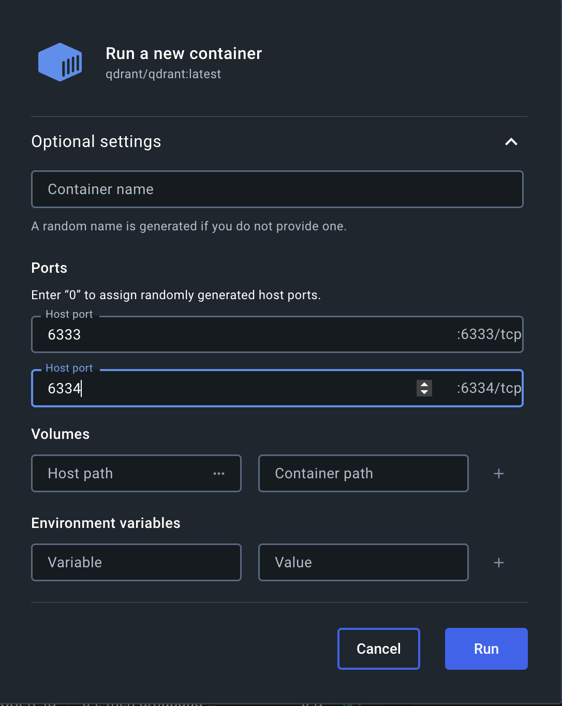
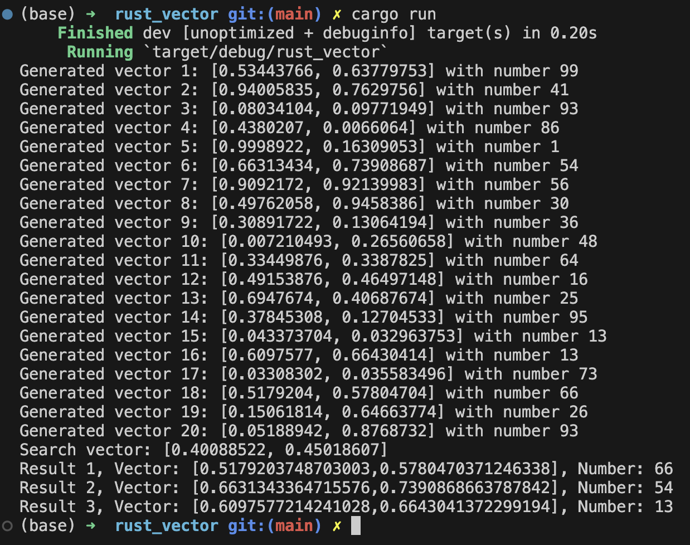

# Rust Vector Database 

[](https://github.com/nogibjj/IDS-721_rg361_week-07/actions/workflows/cicd.yml)

## 1. Overview

In this project ``Rust`` is used to ingest data into a ``qdrant`` vector database and then perform some basic queries and aggregations.
A visualization of the data is also provided for reference.

CI/CD is implemented using Github Actions to automate processes like formatting, linting, etc.

## 2. Introduction

In a vector database, unlike a traditional database, the data is stored in the form of vectors. This allows for faster and more efficient querying of the data where we may need to find the "closest" items to an item we are looking for. Due to this nature, vector databases are used in applications like recommendation systems, search engines, etc.

In this project, we will be using the ``qdrant`` vector database. The qdrant vector database is a high-performance and free vector database that is built using Rust. It is designed to be fast and efficient and can be used in a variety of applications.

Normally, the values will be converted into vectors using a process called embedding, and depending on the application, the embeddings vectors can be of different dimensions. In this project, we will randomly generate 20 vectors of 2 dimensions to simulate an embedding process and attach a number to them. we will then generate a random query vector and find the closest vectors to the query vector.


## 3. Instructions

### 3.1 Pre-requisites
1. [Rust](https://www.rust-lang.org/tools/install)
2. [Docker](https://docs.docker.com/get-docker/)

### 3.2 Qdrant

To use a qdrant vector database, we can make use of the qdrant docker image.

- download the qdrant docker image using the following command:
```bash
docker pull qdrant/qdrant
```

- start the qdrant docker container and bind the ports respectively:  


alternatively, you can use the following command:
```bash
docker run -d -p 6333:6333 -p 6334:6334 qdrant/qdrant
```

- Once the container is running, you can access the qdrant dashboard by visiting the following URL [http://localhost:6333](http://localhost:6333) if required.

**Note**: While the port number can be changed, it is recommended to use the default port number. in case you are using a different port number, make sure to update the port number in the code.

### 3.3 Rust

In rust we can interact with the qdrant database using the ``qdrant-client`` library.

Ensure that you are connecting on the correct port number as defined in the previous step.

The provided rust code performs the following operations:
1. Ingest data into the qdrant database: It generates 20 random vectors to simulate embedding process and attaches a random label to each vector.
2. Perform a basic query: It again generates a random vector and sends it to the qdrant database to find the closest vectors.
3. It processes the results and prints the 3 closest vectors to the query vector.
4. It prints and saves all the data in a JSON file for reference.

To run the code, use the following command:
```bash
cargo run
```

**Sample Excution**:  


### 3.4 Visualization

A 2D visualization is made using the files which the rust code generates.

The following 3 values are plotted on a 2D graph to demonstrate the process:
- The 20 random vectors generated
- The random vector generated for the query
- The 3 closest vectors to the query vector

**Visualization**:


**Note**: since these points are all randomly generated, the visualization may look different each time the code is run.

